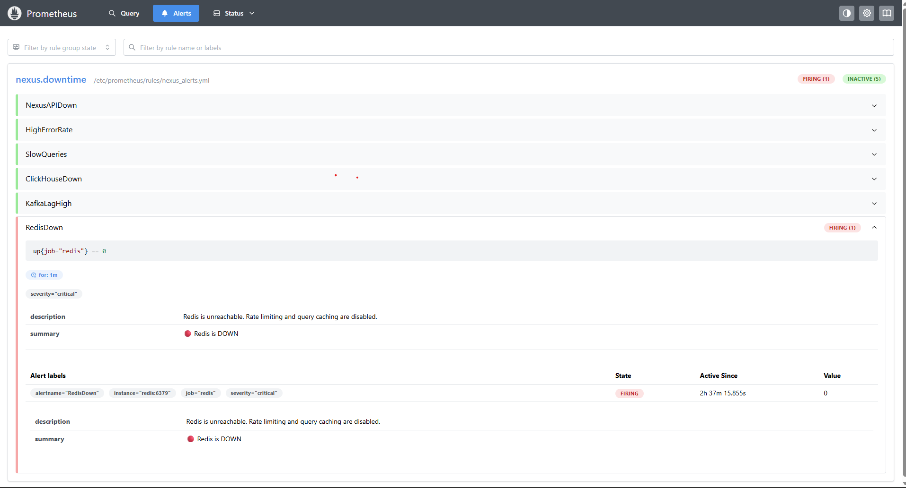
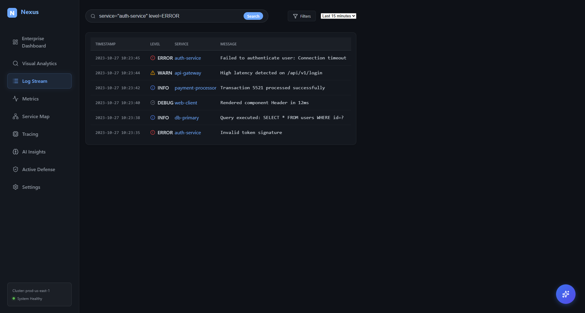
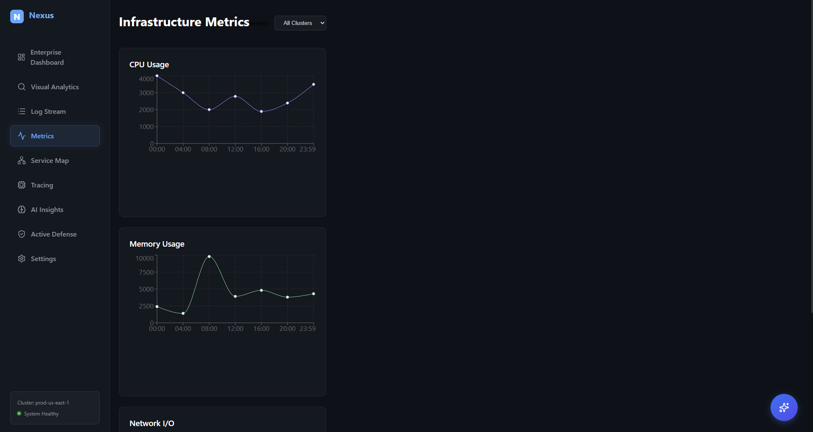
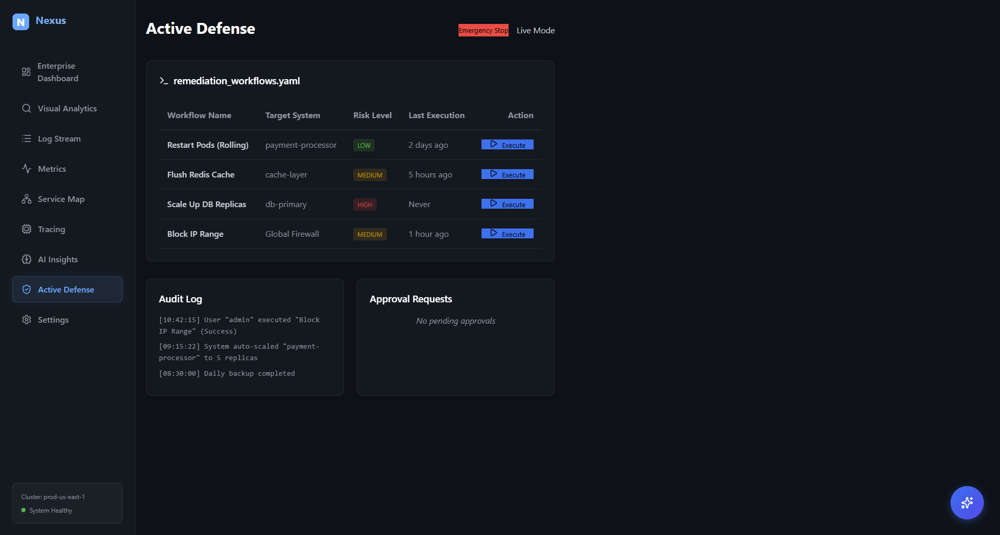

# Nexus Observability Platform
[]()


**Nexus** is a high-performance, self-hosted observability platform designed to provide a comprehensive replacement for commercial tools like Splunk and Datadog. Built for scale, security, and developer experience.

## 🚀 Enterprise Launch Status: STAGE 5 (READY)

The platform has passed the **Final Enterprise Hardening** gate and is ready for controlled beta deployment in production environments.

## 📸 Screenshots

| Enterprise Dashboard | Infrastructure Metrics |
|:---:|:---:|
|  |  |

| Visual Analytics | Prometheus Alerts |
|:---:|:---:|
|  |  |

## 💡 Why Nexus?

*   💸 **Stop Paying per GB**: Self-hosted means no massive Datadog/Splunk bills. You only pay for infrastructure.
*   ⚡ **Blazing Fast**: Built on **ClickHouse** ensuring sub-second queries even on billions of logs.
*   🔓 **No Vendor Lock-in**: Your data lives in open formats. You own the database, the pipeline (Redpanda), and the UI.
*   🛠️ **Do It Yourself**: Complete control over retention, sampling, and security policies.

## 🤝 Request for Feedback
I am actively looking for community feedback on:
1.  **Ingestion Performance**: How does the Go API handle your peak loads?
2.  **UX Improvement**: Is the visual analytics search intuitive?
3.  **Deployment**: Any friction setting this up in your K8s/Docker environment?

> Please open an Issue or Discussion if you have ideas!

## 🏗️ Architecture & Tech Stack

Nexus leverages a modern, cloud-native stack optimized for high throughput and low latency:

*   **Frontend**: React (Vite), Framer Motion, Recharts.
*   **Backend**: Go (Golang) for high-performance API processing.
*   **Log Storage**: ClickHouse (Columnar OLAP for massive log ingestion).
*   **Metrics Engine**: VictoriaMetrics (High-cardinality TSDB).
*   **Event Streaming**: Redpanda (Kafka-compatible, zero-dependency).
*   **Identity & Access**: Keycloak (Enterprise SSO, RBAC, OIDC).
*   **Caching**: Redis.
*   **Alerting**: Prometheus & Alertmanager.

## ✨ Key Capabilities

*   **Unified Observability**: Seamlessly correlate Logs, Metrics, and Traces in a single pane of glass.
*   **Enterprise Security**: Full RBAC, Audit Logging, TLS/HSTS, and Secrets Management.
*   **Resilience**: Built-in Circuit Breakers, Global Rate Limiting, and Graceful Restarts.
*   **Compliance**: Immutable Data Retention policies, GDPR-ready data purging.
*   **Performance**: Capable of ingesting 100k+ logs/second per node with sub-second search latency.

## 🛠️ Quick Start

### Prerequisites
*   Docker & Docker Compose
*   Node.js 18+ (for local frontend dev)
*   Go 1.21+ (for local backend dev)

### Run with Docker (Recommended)
Deploy the full stack including all infrastructure dependencies:

```bash
# Start all services
docker-compose up -d

# Check status
docker-compose ps
```

### Access Points
| Service | URL | Credentials (Default) |
| bound | :--- | :--- |
| **Web UI** | `http://localhost:3000` | N/A |
| **API Gateway** | `http://localhost:8080` | N/A |
| **ClickHouse** | `http://localhost:8123` | N/A |
| **Keycloak** | `http://localhost:8081` | admin / admin |
| **Prometheus** | `http://localhost:9090` | N/A |

### Simulation & Testing
Generate synthetic load to verify system stability:
```bash
# Run K6 load test
k6 run tests/load/ingestion_test.js
```

## 📖 Documentation

*   [**Production Implementation Guide**](./PRODUCTION_GUIDE.md) - Detailed deployment, security, and infrastructure setup.
*   [**Runbooks**](./RUNBOOKS.md) - Incident response, troubleshooting, and operations.
*   [**Architecture Standards**](./ARCHITECTURE.md) - Core design decisions and ADRs.
*   [**Integration Guide**](./INTEGRATION_GUIDE.md) - How to ship data to Nexus.

## 💻 Local Development

**Frontend**:
```bash
npm install
npm run dev
```

**Backend**:
```bash
cd backend
go run main.go
```


